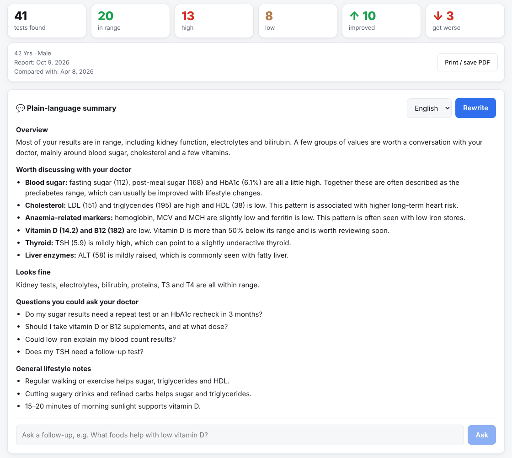
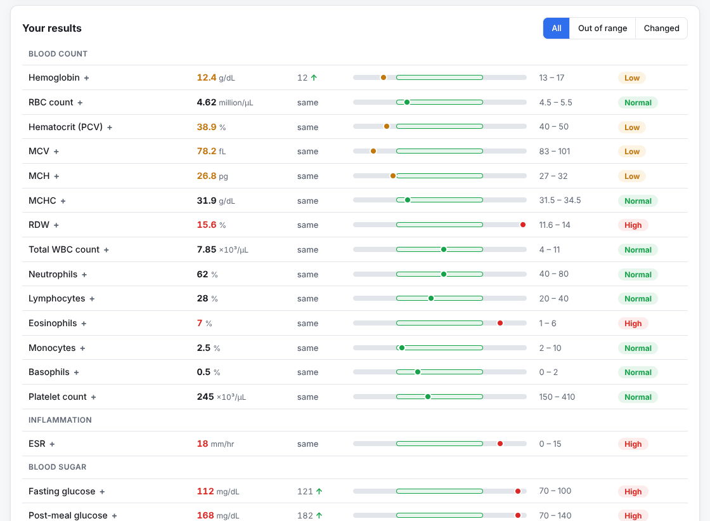
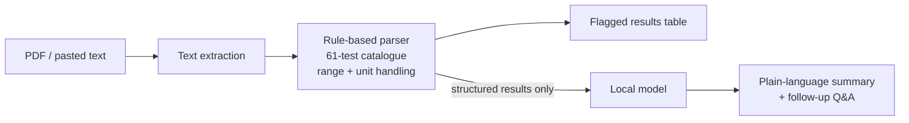

# 🧪 Lab Report Explainer

Upload a blood test report (PDF or text). See every value flagged **low / normal / high** against its reference range — then get a calm, plain-language summary in English, Hindi, Marathi, Urdu, Gujarati or Arabic.

**The flagging is 100% rule-based and runs locally.** AI is only used for the friendly summary and follow-up questions, and by default that's a local model too (Ollama). Nothing is sent to a cloud service unless you configure one.




> ⚠️ Educational tool, not medical advice. Reference ranges vary between labs; always discuss results with a qualified doctor.

## Features

- **Parser built for real Indian lab layouts:** `Haemoglobin 12.4 L g/dL 13.0 - 17.0`, `Platelet Count 2.45 lakhs/cumm`, `7,850 /cumm`, `1,50,000`, `Desirable <200, Borderline 200-239`, `>40`, `mm/1st hr`, dates/times in headers…
- **Compare with an earlier report:** see each test's previous value, % change and whether it **improved** or **got worse** — judged against the range, so moving into range counts as better and drifting within it doesn't. Filter to just the tests that changed; the summary leads with what changed.
- **61 common tests** across blood count, sugar, lipids, kidney, electrolytes, liver, thyroid, vitamins and iron (including lipid ratios, non-HDL, eGFR and estimated average glucose) — each with a plain explanation of what it measures and what a low/high value can be associated with.
- **Prefers the range printed on your report**; falls back to typical adult ranges (sex-specific where it matters) and labels them as _typical_.
- **Unit normalisation:** counts in /µL or lakhs are converted so values and ranges compare correctly.
- **Unknown tests aren't lost:** any line with a name, value and printed range is kept under _Other_.
- **Visual range bars**, out-of-range filter, click a row for details, print / save as PDF.
- **AI summary with guardrails:** no diagnoses, no medicines or doses, cautious wording, grouped findings, questions to ask your doctor, and a nudge to see a doctor soon when values are far outside range.
- **Follow-up questions** about your results, in your chosen language. Summaries and answers stream as they're written.
- **Report date detection** (`09-10-2026`, `3 Mar 2026`, ISO) for labelling comparisons.



<sub>Screenshots use the built-in fictional sample reports.</sub>

## How it works



The model never sees the raw report text — only the structured results — which keeps personal details out of the prompt and keeps the explanation tied to the actual numbers.

## Quick start

**Requirements:** Node.js 20+. [Ollama](https://ollama.com) for the summaries.

```bash
ollama pull qwen2.5:7b      # handles Hindi and other languages reasonably well
npm run setup
npm run dev
```

Open http://localhost:5174 and click **Try a sample report** or **Sample comparison**.

### Production

```bash
npm run build && npm start       # http://localhost:3004
# or
docker compose up -d && docker compose exec ollama ollama pull qwen2.5:7b
```

The server listens on `127.0.0.1` by default, so only this computer can reach it. Set `HOST=0.0.0.0` in `server/.env` to open it to your network (the Docker image does this for you).

Scanned (image-only) PDFs have no text layer — run OCR first or paste the text.

## Switching AI provider

Set `LLM_PROVIDER` in `server/.env`: `ollama` (default), `openai` (any OpenAI-compatible endpoint), `anthropic`, or `none` (flags only). See `server/.env.example`.

## API

| Method | Path                                            | Notes                                                                             |
| ------ | ----------------------------------------------- | --------------------------------------------------------------------------------- |
| `POST` | `/api/upload`                                   | `multipart file` (+ `sex`) → `{ text, parsed }`                                   |
| `POST` | `/api/parse`                                    | `{ text, sex? }` → `{ parsed }` (no AI)                                           |
| `POST` | `/api/compare`                                  | `{ current, previous, sex? }` → per-test previous value, change and trend (no AI) |
| `POST` | `/api/explain`                                  | `{ parsed, language }` → NDJSON stream of the summary                             |
| `POST` | `/api/ask`                                      | `{ parsed, question, language }` → NDJSON stream of the answer                    |
| `GET`  | `/api/tests` · `/api/sample` · `/api/languages` | Catalogue, demo reports, languages                                                |

## Extending the catalogue

Add an entry to `server/src/catalog.ts` with its aliases, unit, range (or `{ male, female }`), and plain-language notes. The parser picks it up automatically; add a case to `parser.test.ts`.

## License

MIT © Faisal
